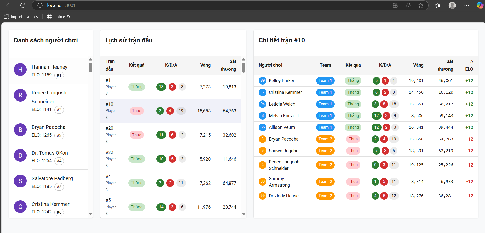

# Thuật toán tính điểm Elo trong mô phỏng trận đấu

## 1. Công thức tính điểm Elo

Công thức tính điểm **Elo** được áp dụng như sau:

$$
\Delta \text{Elo} = K \times (result - expectedScore)
$$

Trong đó:

- `K` là hệ số điều chỉnh (ở đây: `K = 24`)
- `R`: kết quả trận đấu của người chơi (`1` nếu thắng, `0` nếu thua)
- `E`: xác suất thắng được dự đoán trước trận dựa trên Elo trung bình của hai đội

---

## 2. Công thức tính **expectedScore** (xác suất thắng)

$$
expectedScore = \frac{1}{1 + 10^{\frac{eloA - eloB}{400}}}
$$

Trong đó:

- `eloA`: Elo trung bình của đội A
- `eloB`: Elo trung bình của đội B
- Hàm trả về giá trị từ `0` đến `1`, đại diện cho xác suất thắng của đội A so với đội B

### Ví dụ:

- Nếu hai đội có Elo bằng nhau → `expectedScore = 0.5` (xác suất thắng là 50%)
- Nếu đội A có Elo cao hơn nhiều → `expectedScore` tiến gần đến `1`

---

## 3. Cách áp dụng vào trận đấu mô phỏng

1. **Chọn 10 người chơi ngẫu nhiên**, chia làm hai đội:

2. **Tính Elo trung bình của mỗi đội**:

3. **Tính xác suất thắng (`expectedScore`) của mỗi đội**:

4. **Xác định đội thắng bằng xác suất**:

5. **Cập nhật Elo cho từng người chơi**:


## 4. Tổng kết

Hệ thống Elo mô phỏng này:

- Cân bằng giữa kỹ năng và may mắn (bằng `expectedScore`)
- Cho phép mỗi trận đấu ảnh hưởng đến điểm Elo của người chơi
- Cập nhật dữ liệu vào bảng `match_player` và `players` trong cơ sở dữ liệu

---

## 5. Cách chạy thử code

Tạo thư mục .env như ví dụ trong env.txt
```js
#Thêm giá trị vào những trường sau tùy chỉnh
DB_HOST=
DB_USER=
DB_PASSWORD=
DB_NAME=
DB_PORT=

```

Với chạy lần đầu, tại thư mục **Exc-08May** chạy

```js
- docker compose up --build
- client/ npm run build (Optional)
```

Sau đó backend sẽ lắng nghe trên port local/3000: `https:localhost:3000`

Bao gồm các API

- **/api/players**: Lấy danh sách toàn bộ player
- **/api/matchPlayers**: Lấy danh sách toàn bộ trận đấu của người chơi trong bảng match_player
- **/api/matchPlayers/:id**: Lấy danh sách lịch sử trận đấu theo player
- **/api/matchPlayers/match/:id**: Lấy thông tin toàn bộ thông số của người chơi trong trận đấu với matchId

FE sẽ được chạy trên port local/3001: `https:localhost:3001`

## 6. Giao diện
